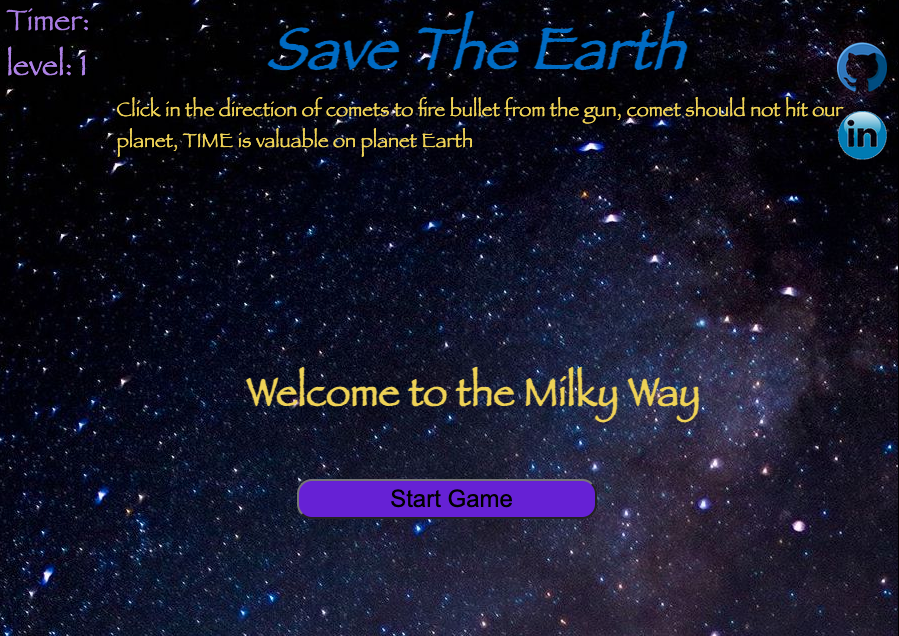
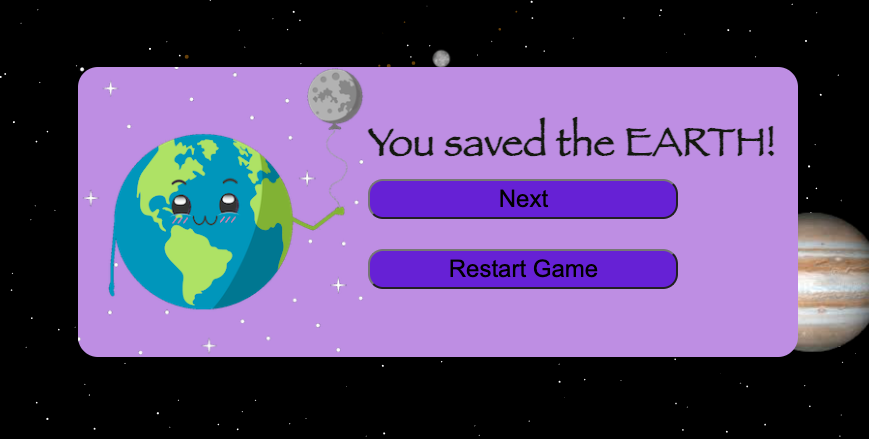
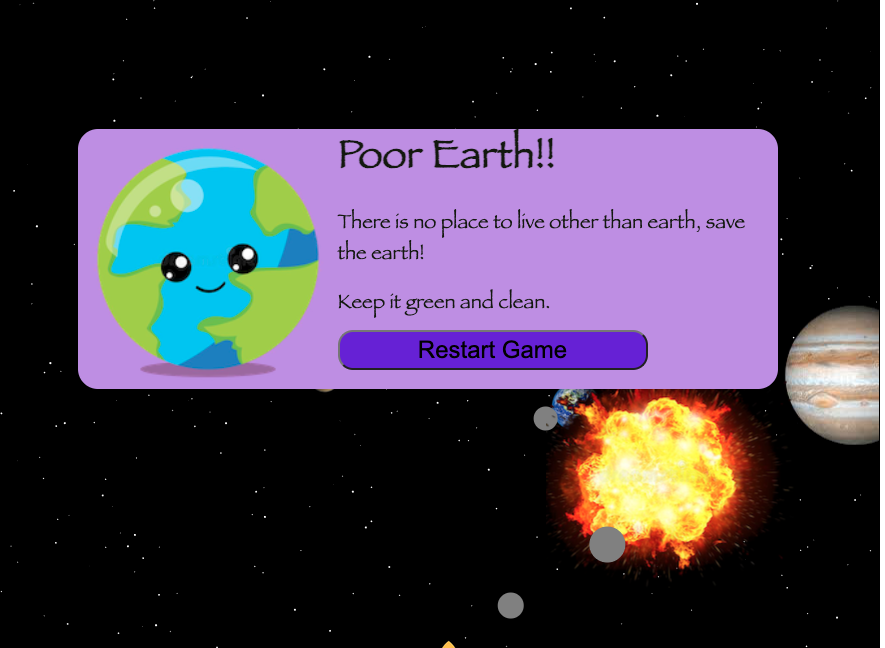

# SAVE THE EARTH

  [Click here to Play](https://kirti-harode.github.io/SaveTheEarth/)

  NOTE: Play it in a minimized window. In full screen, it doesn't sense the click correctly (working on it).
   
"Save the Earth" is a Solar system game, implemented using javascript, HTML5 canvas, webpack and utilizing Object Oriented design principles.

## Overview

The game is set up in our solar system which has a stationary sun and planets revolving around it (including earth) in circular orbits. There is an ongoing fire of comets in the gaming frame which may or may not hit the earth. The player has a gun at the bottom of the frame from which the player can fire bullets in the direction of comets to destroy them. If the earth is not destroyed by a comet within a specified time, the player wins. There is also a timer that players can see in the gaming frame.


## Functionality & MVPs

  In Save The Earth, the game's features are:

 
  * The player is able to start the game.

  

  * The game is timer-based (no score). The Player's job is to save Earth from comets within the time limit.
  * There is a winning message and a button to restart the game when the player destroys all the comets and a next button to move on to the next level.

  

  * If any comet hits the earth, there is a graphic to show an explosion and a pop-up with some slogans and a restart game button.

  

  * With each level number of comets will increase and their velocity will also increase.
  * There is music and sounds for explosions, and a button to stop the music.
  

## Technologies, Libraries, APIs

  * Canvas API to create the solar system and comets.
  * Webpack to bundle and transpile the source Javascript code
  * node.js/npm to manage project dependencies

## Wireframes


## Implementation Timeline

  * **Prep for the project:** Become familiar with libraries and create the project files and README.
  * **Day 1:**  Create a basic framework to run the game. Draw different sizes of circles to represent stationary Sun and planets.
  * **Day 2:**  Write code for moving the planets, draw orbits for them to see they are moving in a circular motion and add planet images, write code for drawing different size stars, and make a stationary gun.
  * **Day 3:**  Code for firing bullets from the gun in the direction of the comet and conduct testing to check everything is working as intended.
  * **Day 4:**  Code for detecting collision (earth and comet, comet and bullet), when collides with comet change color of the bigger comet and make them small, and then disappear comet and bullet.
  
    * Detecting collision between earth and a comet was challenging, I used an image for the earth and a circle for the comet, and since the earth, is always rotating so it was difficult to figure out the math to get min distance between their center points.I figured it out by adding half of the width and height of the earth image with the position of the earth on canvas on the x-axis and y-axis respectively. And then used the Pythagoras theorem to calculate the distance between the center point of the earth image and the comet.

      ```js
      comets.forEach((comet, cometIndex) =>{
            comet.move();
            // if collides with the earth, end game.
            
            const distance = Math.hypot((earth.x + earthImg.width/2 )- comet.x, (earth.y + earthImg.height/2) - comet.y);
            if((distance - comet.radius - earthImg.width/2 ) < -9.9){
                const customEvent = new Event('colision');
                window.dispatchEvent(customEvent);
                
                ctx.drawImage(explosion, earth.x, earth.y);
            }
            
            // if colids remove comet and bullet
            bullets.forEach((bullet, bulletIndex) => {   
                const distance = Math.hypot(bullet.x - comet.x, bullet.y - comet.y);
                if((distance - comet.radius - bullet.radius) < 0.5){
                    comet.color = 'orange';

                    // create explosions
                     for(let i = 0; i < (comet.radius) * 2; i++){
                         const evelocity = {x: ((Math.random() - 0.5) * (Math.random() * 8)), y: ((Math.random() - 0.5) * (Math.random() * 8))};
                         explosions.push(new Explosion(bullet.x, bullet.y, Math.random() * 2, 'orange', evelocity));
                     }

                    if(comet.radius - 8 > 8){
                        comet.radius -= 8;
                        bullets.splice(bulletIndex, 1);
                    }
                    else{
                        comets.splice(cometIndex, 1);
                        bullets.splice(bulletIndex, 1);
                    }
                }   
            })
      }
      ```
  * **Day 5:**  Code for showing explosion when comet colids with the earth, set timer, add start game button and when times up or comet hit the earth display Game over message.
  * **Day 6:**  Style code, add some images to pop-ups Add more levels (increase the no. of comets and their velocity as the level increases), add music and sound to the game and create a button to stop the music.
  * **Day 7:** Add GitHub and LinkedIn links, add instructions and the game title on the top of the page, conduct Testing, and deploy the project on the Github page.

## Future features
  * Make movable gun.
  * Add images to the comets.
  * Add option for reflecting the comets instead shooting them.
  * Make it work for every window size (including phone).