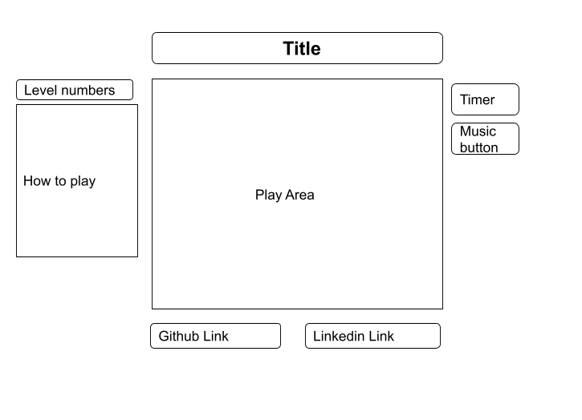

# SAVE THE EARTH

"Save the Earth" is a Solar system game, implemented using javascript, HTML5 canvas, webpack and utilizing Object Oriented design principles.

## Overview

Game will be setup in our solar system which will have a stationary sun and planets revolving around it (including earth) in circular orbits. There will be an ongoing fire of comets in  the gaming frame which may or may not hit the earth. Player will have a gun at the bottom of the frame from which player can fire bullet in the direction of comets to destroy them. If earth is not destroyed by a comet within a specified time, player wins. There will also be a timer which player will see in the gaming frame.

## Functionality & MVPs

  In Save The Earth, the game's features will be:

  * Game will be timer based (no score). Player's job is to save Earth from comets within the time limit.
  * Player will able to Start the game.
  * Game will have multiple levels.
  * With each level number of comets will increase and there velocity will also increase.
  

## Technologies, Libraries, APIs

  * Canvas API to create solar sytem and comets.
  * Webpack to bundle and transpile the source Javascript code
  * node.js/npm to manage project dependencies

## Wireframes

## Implementation Timeline

  * **Prep for project:** Become familier with libraries and create the project files and README.
  * **Day 1:**  Create basic framework to run the game. Draw different sizes of circle to represent stationary Sun and planets
  * **Day 2:**  Write code for moving the planets and add planet images, write code for drawing different size stars, and make a stationary gun.
  * **Day 3:**  Code for firing bullets from gun in the direction of comet, conduct testing to check everything is working as intended.
  * **Day 4:**  Code for detecting collision (earth and comet, comet and bullet), when collids with comet change color of bigger comet and make them small, and disappear comet and bullet.
  * **Day 5:**  Code for showing explosion when colids, set timer, add start game button and when times up or comet hit the earth display Game over message.
  * **Day 6:**  Add more level (increase no of comets and there velocity as level increases)
  * **Day 7:** Add github and linkdin links, Testing and submission.

## Future features
  * Add option for reflecting the comets instead shooting them.
  * Make movable gun.
  * Add music to the game.