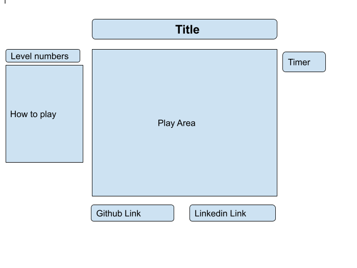

# SAVE THE EARTH

Save the Earth is a Solar system game, designed using javascript, canvas, webpack and utilizing Object Oriented design principles.

## Overview

This game will have all the planets rotating around the sun.
The player's job is to save our planet the earth from asteroids/ comets /other solar system objects using a gun in the given time.

## Functionality & MVPs

  In Save The Earth, the game's features will be:

  * Player will able to Start, pause the game
  * There will be a timer 
  * Pause and start button for music
  * Game will have multiple levels
  * With each level number of comets wil increase and there direction will change
  

## Technologies, Libraries, APIs
  * Canvas API
  * Webpack 
  * node.js

## Wireframes

## Implementation Timeline
  * **Prep for project:** Become familier with libraries and create the project files and README.
  * **Day 1:** Create basic framework to run the game. Draw stationary Sun and planets
  * **Day 2:**  Write code for moving the planets and a moving gun
  * **Day 3:** 
  * **Day 4:** 
  * **Day 5:** 
  * **Day 6:** 
  * **Day 7:** 

## Bonus features
  * Add option for reflecting the comets insted shooting them